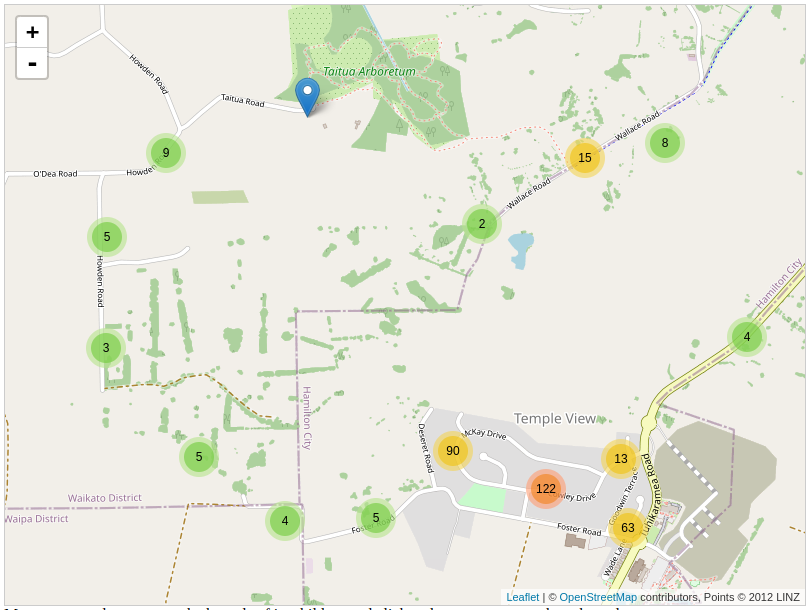

# Construindo mapas com cluster de marcadores usando Angular e Leaflet

É incrível a quantidade de soluções tecnológicas que temos hoje em dia que de alguma forma usam dados geográficos. Sabemos que os dados geográficos, por si só, não fazem sentido nenhum e precisam de um processamento inteligente e de forma amigável serem apresentados como solução de algum problema aos usuários. Você já deve imaginar do que estou falando, e temos aí diariamente sendo utilizado por milhares de pessoas aplicativos como Uber (Transporte), Google Maps/Waze (GPS), Ifood (Entrega), e até mesmo dentro da área do entretenimento, que é o Pokémon Go como um ótimo exemplo. Portanto, o que eu posso afirmar aqui é que sem dúvidas existem diversos problemas onde poderiam perfeitamente serem resolvidos com uma solução tecnológica que utiliza a geolocalização. 


## Visão Geral

Para nós como desenvolvedores, é sempre importante ter conhecimento das ferramentas adequadas para solucionar os diferentes problemas que nos são apresentados em nosso dia a dia, e neste artigo estarei apresentado a vocês de forma prática como implementar um mapa com clusterização de pontos geográficos dentro do seu projeto desenvolvido em Angular.

## Clusterização de Marcadores

De forma geral, o termo clusterização é usado para se referir ao ato de agrupar, categorizar, combinar dois ou mais recursos com o objetivo de ter um resultado final otimizado. Para o contexto de informação geográfica, a idéia é, dependendo do nível de zoom, agrupar dois ou mais pontos geográficos mais próximos permitindo que seja visto apenas um ponto, mas com a quantidade que aquele ponto representa, conforme mostra a Figura 1 abaixo. Essa técnica é usada com bastante frequência em sistemas que fornecem algum tipo de visualização geográfica de grandes volumes de dados estatísticos geográficos que hoje já temos a definição de Geo Big Data. Já imaginou o custo computacional e até mesmo a poluição visual que seria ter milhares de pontos plotados em um mapa? Então a essa altura eu acredito que você já deve ter entendido a importância dessa técnica, certo? Sem mais demora, vamos conhecer e colocar em prática o uso dessas ferramentas.


Figura 1: Exemplo de clusterização de pontos geográficos.

## Leaflet e sua extensão Leaflet.markercluster

[Leaflet](https://leafletjs.com/) é uma biblioteca open-source JavaScript criada em 2010 e bastante usada na produção de mapas interativos. Já o [Leaflet.markercluster](https://github.com/Leaflet/Leaflet.markercluster) se trata de uma extensão/plugin que implementa o comportamento visual de clusterização dos pontos geográficos.


## Instalação e Configuração

Com o nosso gerenciador de pacotes **npm** vamos separar as instalações, sendo primeiramente a biblioteca **Leaflet** e suas dependências e logo em seguida o plugin **Leaflet.markercluster** e suas respectivas dependências. 

```
npm install leaflet
npm install @asymmetrik/ngx-leaflet
npm install --save-dev @types/leaflet
```

A última dependência é utilizada para definir a tipagem para uso na codificação em TypeScript, portanto não sendo necessário o uso em produção, apenas em desenvolvimento, e por esse motivo é utilizado a flag `--save-dev` no comando de instalação.

Seguimos os mesmos passos para a instalação do plugin **Leaflet.markercluster**:

```
npm install leaflet.markercluster
npm install @asymmetrik/ngx-leaflet-markercluster
npm install --save-dev @types/leaflet.markercluster
```

Feito a instalação das dependências acima, vamos para o arquivo **angular.json** e adicionamos as referências para os arquivos de estilo **.css** de ambas as bibliotecas dentro da propriedade `"styles"`:

```
"./node_modules/leaflet/dist/leaflet.css",
"./node_modules/leaflet.markercluster/dist/MarkerCluster.Default.css"
```

No final, o arquivo deve ficar algo como:

```
...
"projects":{
    ...
    "arquitect":{
        "build": {
            ...
            "options":{
                ...
                "styles": [
                    ...
                    "./node_modules/leaflet/dist/leaflet.css",
                    "./node_modules/leaflet.markercluster/dist/MarkerCluster.Default.css"
                ],
            }
        }
    }
}
```


## Implementação


## Visualização de Aeroportos do Brasil

To get more help on the Angular CLI use `ng help` or go check out the [Angular CLI Overview and Command Reference](https://angular.io/cli) page.
