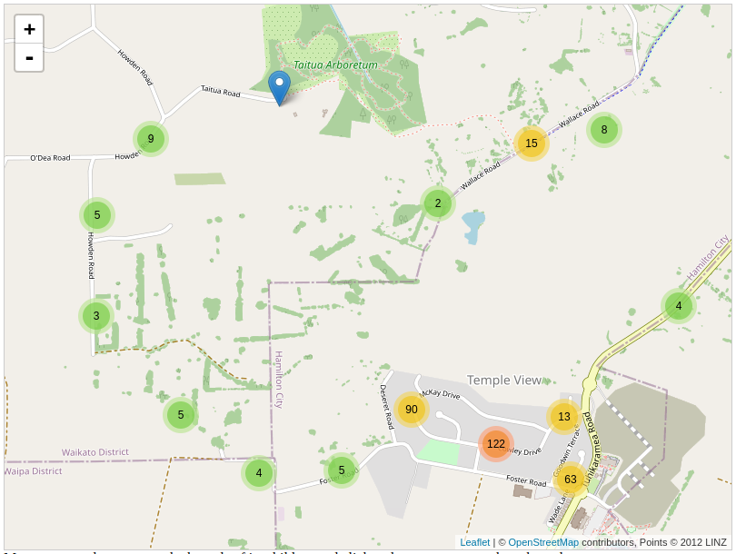
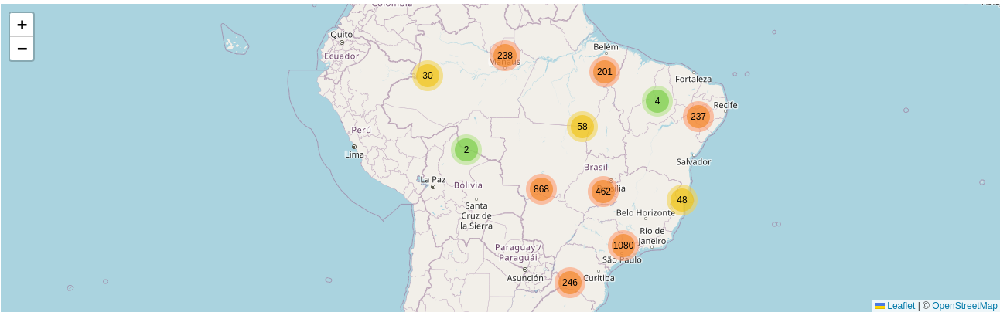

# Construindo mapas com cluster de marcadores usando Angular e Leaflet

É incrível a quantidade de soluções tecnológicas que temos hoje em dia que de alguma forma usam dados geográficos. Sabemos que os dados geográficos, por si só, não fazem sentido nenhum e precisam de um processamento inteligente e de forma amigável serem apresentados como solução de algum problema aos usuários. Você já deve imaginar do que estou falando, e temos aí diariamente sendo utilizado por milhares de pessoas aplicativos como Uber (Transporte), Google Maps/Waze (GPS), Ifood (Entrega), e até mesmo dentro da área do entretenimento, que é o Pokémon Go como um ótimo exemplo. Portanto, o que eu posso afirmar aqui é que sem dúvidas existem diversos problemas onde poderiam perfeitamente serem resolvidos com uma solução tecnológica que utiliza a geolocalização. 


## Visão Geral

Para nós como desenvolvedores, é sempre importante ter conhecimento das ferramentas adequadas para solucionar os diferentes problemas que nos são apresentados em nosso dia a dia, e neste artigo estarei apresentado a vocês de forma prática como implementar um mapa com clusterização de pontos geográficos dentro do seu projeto desenvolvido em Angular.

## Clusterização de Marcadores

De forma geral, o termo clusterização é usado para se referir ao ato de agrupar, categorizar, combinar dois ou mais recursos com o objetivo de ter um resultado final otimizado. Para o contexto de informação geográfica, a idéia é, dependendo do nível de zoom, agrupar dois ou mais pontos geográficos mais próximos permitindo que seja visto apenas um ponto, mas com a quantidade que aquele ponto representa, conforme mostra a Figura 1 abaixo. Essa técnica é usada com bastante frequência em sistemas que fornecem algum tipo de visualização geográfica de grandes volumes de dados estatísticos geográficos - que hoje já temos como definição o nome **Geo Big Data**. Já imaginou o custo computacional e até mesmo a poluição visual que seria ter milhares de pontos plotados na mesma região em um mapa? Então a essa altura eu acredito que você já deve ter entendido a importância dessa técnica, certo? Sem mais demora, vamos conhecer e colocar em prática o uso dessas ferramentas.


Figura 1: Exemplo de clusterização de pontos geográficos.

## Leaflet e sua extensão Leaflet.markercluster

[Leaflet](https://leafletjs.com/) é uma biblioteca open-source JavaScript criada em 2010 e bastante usada na produção de mapas interativos. Já o [Leaflet.markercluster](https://github.com/Leaflet/Leaflet.markercluster) se trata de uma extensão/plugin que implementa o comportamento visual de clusterização dos pontos geográficos.


## Instalação e Configuração

Com o nosso gerenciador de pacotes **npm**, vamos separar as instalações, sendo primeiramente a biblioteca **Leaflet** e suas dependências e logo em seguida o plugin **Leaflet.markercluster** e suas respectivas dependências. 

```
npm install leaflet
npm install @asymmetrik/ngx-leaflet
npm install --save-dev @types/leaflet
```

A última dependência é utilizada para definir a tipagem para uso na codificação em **TypeScript**, portanto não sendo necessário o uso em produção, apenas em desenvolvimento, e por esse motivo é utilizado a flag `--save-dev` no comando de instalação.

Seguimos os mesmos passos para a instalação do plugin **Leaflet.markercluster**:

```
npm install leaflet.markercluster
npm install @asymmetrik/ngx-leaflet-markercluster
npm install --save-dev @types/leaflet.markercluster
```

Feito a instalação das dependências acima, vamos para o arquivo **angular.json** e adicionamos as referências para os arquivos de estilo **.css** de ambas as bibliotecas dentro da propriedade `"styles"`:

```
"./node_modules/leaflet/dist/leaflet.css",
"./node_modules/leaflet.markercluster/dist/MarkerCluster.Default.css"
```

No final, o arquivo deve ficar com uma estrutura semelhante ao trecho abaixo:

```
...
"projects":{
    ...
    "arquitect":{
        "build": {
            ...
            "options":{
                ...
                "styles": [
                    ...
                    "./node_modules/leaflet/dist/leaflet.css",
                    "./node_modules/leaflet.markercluster/dist/MarkerCluster.Default.css"
                ],
            }
        }
    }
}
```

Agora você já pode importar os módulos instalados a partir das dependências **ngx-leaflet** e **ngx-leaflet-markercluster** dentro do módulo onde você deseja fazer o uso dessa funcionalidade (no **AppModule** por exemplo) adicionando também no array de `imports` conforme mostra abaixo:

```
imports: [
    ...,
    LeafletModule,
    LeafletMarkerClusterModule
  ],
```

Se você concluiu todos os passos de configuração acima, então sua aplicação está pronta para ser implementada.

## Implementação

Aqui, vamos começar com a parte lógica do componente (**arquivo .ts**) e logo em seguida incluímos o conteúdo do template (**arquivo .html**) e do estilo **.css**.

Primeiramente vamos declarar as variáveis necessárias para o funcionamento do nosso componente. E para isso, devemos importar o módulo da biblioteca **Leaflet** e as principais funções dela, que estaremos usando também.

```
import * as L from 'leaflet';
import { icon, latLng, marker } from 'leaflet';
```

Em seguida, a parte inicial do componente deve ficar da seguinte forma:

```
export class AppComponent {

  map!: L.Map;
  markerClusterGroup!: L.MarkerClusterGroup;
  markerClusterData = [];

  options = {
    layers: [
      L.tileLayer('https://{s}.tile.openstreetmap.org/{z}/{x}/{y}.png', {
        attribution: '&copy; <a href="https://www.openstreetmap.org/copyright">OpenStreetMap</a>'
      })
    ],
    zoom: 4,
    center: { lat: -14.4095261, lng: -51.31668 }
  }

  ngOnInit(){
    this.markerClusterGroup = L.markerClusterGroup({removeOutsideVisibleBounds: true});
  }
  ...
}
```

Para esse trecho acima, gostaria de deixar algumas observações aqui. O sinal "**!**" foi adicionado para suprimir um *warning* do TypeScript que exige a inicialização das respectivas variáveis junto com a declaração. Mas não se preocupe, pois logo abaixo é garantido que essas variáveis serão inicializadas. O objeto `option` é onde definimos a referência para a camada do mapa mundial, e nesse caso optei pelo **OpenStreetMap**, mas poderia muito bem ser trocado por outra fonte como o Google Maps, Bing Maps, dentre outros disponíveis. 

Em relação às propriedades **zoom** e **center**, foi a combinação de valores que encontrei que conseguisse enquadrar melhor todo o território Brasileiro. Na sessão a seguir, você vai entender melhor o motivo de enquadrar no mapa o Brasil.

Feito isso, vamos para a próxima etapa que é onde conseguimos os dados de pontos geográficos que usaremos como marcadores. 

### Visualização de Aeroportos/Pistas de pouso e decolagem do Brasil

Como Brasileiro, logo que pensei nessa funcionalidade, fui em busca de informações interessantes que eu pudesse apresentar como exemplo utilizando dados do nosso próprio país. É claro que também não poderia ser algo complexo que pudesse de alguma forma confundir a cabeça dos leitores. Foi então que encontrei a API da [https://airlabs.co/](https://airlabs.co/) que nos fornece as posições geográficas (latitude e longitude) dos Aeroportos e Pistas de pouso e decolagem do Brasil. 

É bastante simples de usar, basta se cadastrar e é fornecido uma chave para realizar a consulta na API. Para tentar também não estender muito esse artigo, eu salvei em um arquivo **.json** o resultado da requisição na API (no endpoint `https://airlabs.co/api/v9/airports?country_code=BR&api_key=[chave_api_aqui]`), já que deixarei também disponível o repositório para ser testado (e não estourar a cota de requisições, já que a API também possui um limite).

Dessa forma, voltamos ao nosso componente para fazer alguns ajustes. Mas antes, é importante verificar se no arquivo **tsconfig.json** está definido como `true` a propriedade `"resolveJsonModule"`, da seguinte forma:

```
{
  "compileOnSave": false,
  "compilerOptions": {
      ...,
      "resolveJsonModule": true
    },
    ...
}    
```

Assim, podemos então importar o arquivo que contém as localizações dentro do componente:

```
import * as geoJsonData from '../assets/brazil_airports.json';
```

Também declarar uma variável com o conteúdo do arquivo:

```
brazilAirportsMarkers: any = geoJsonData;
```

E criar um método para fazer a leitura dos dados e gerar os marcadores que serão adicionados no mapa, conforme as coordenadas geográficas. E é onde usamos também as funções **icon**, **latLng** e **marker** que importamos anteriormente:

```
initMarkers() {

  this.brazilAirportsMarkers.response.forEach( (item:any) => {
    const mapIcon = this.getDefaultIcon();
    const coordinates = latLng([item.lat, item.lng]);
    let layer = marker(coordinates).setIcon(mapIcon);
    this.markerClusterGroup.addLayer(layer);
  });        

  this.addLayersToMap();
}  

private getDefaultIcon() {
    return icon({
      iconSize: [25, 41],
      iconAnchor: [13, 41],
      iconUrl: 'assets/marker-icon.png'
  });
}

private addLayersToMap() {
  this.markerClusterGroup.addTo(this.map);
}
```

Por fim, vamos incluir também o método que é acionado com o disparo do evento *leafletMapReady*, e que por sua vez chama o método **initMarkers()**, que é responsável por gerar os marcadores:


```
onMapReady($event: L.Map) {
  this.map = $event;
  this.initMarkers();
}  
```

O conteúdo do arquivo de template deve então ficar da seguinte forma:

```
<div class="map-container"
  leaflet
  [leafletOptions]="options"
  (leafletMapReady)="onMapReady($event)"
  [leafletMarkerCluster]="markerClusterData">
</div>
```

Fechamos então com o conteúdo do arquivo de estilos **.css** que, por se tratar de apenas uma propriedade dentro de uma classe, poderia também sem problemas ser adicionado *inline*.

```
.map-container {
    height: 400px;
}
```

Com isso, basta executar o comando `npm serve` e teremos esse belo mapa com a clusterização de marcadores:


Figura 2: Clusterização de marcadores onde estão localizados os Aeroportos e Pistas de decolagem e pouso no Brasil.

O código completo você pode acessar através do [repositório](https://github.com/eidercarlos/ng-markercluster-brazil-airports) que criei no meu GitHub.


## Conclusão

É claro que a biblioteca **Leaflet** possui uma diversidade de [plugins](https://leafletjs.com/plugins.html) que permitem enriquecer ainda mais a interação e a experiência do usuário com a visualização de informações geográficas. Quem sabe em um próximo artigo podemos explorar e apresentar uma outra funcionalidade interessante.

Espero que tenha conseguido expressar de forma simples e intuitiva o conteúdo deste artigo. Mas caso tenha ficado alguma dúvida, sugestão ou crítica, deixo aqui meu e-mail (eidercarlos@gmail.com) e fiquem à vontade para entrar em contato.

Abraços!

